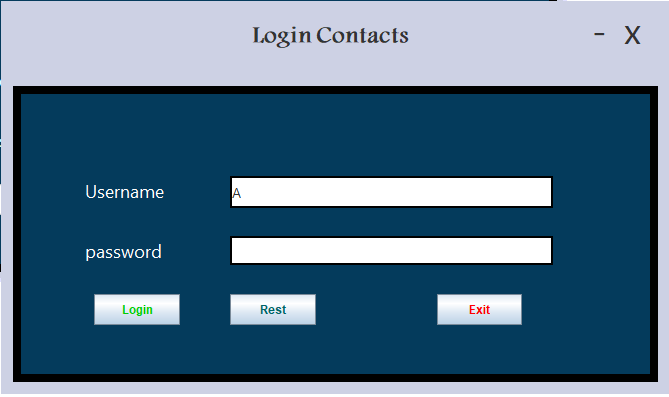
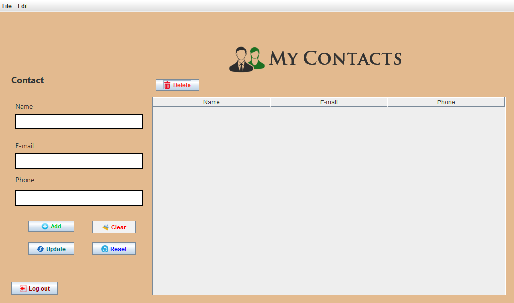

# 📇 myContactsSystem - Java Swing Contact Manager

A simple yet functional desktop application built using **Java Swing**, designed for managing personal contacts with login authentication.

---

## 📌 Description

`myContactsSystem` is a GUI-based Java application that allows users to:

- Log in using a secure login form.
- Add, update, and delete contacts.
- View all contacts in a table format.
- Use a clean and minimalistic interface for better usability.

---

## 🎯 Features

### 🔐 Login Screen
- Secure access to the main app using a username and password.
- Centered form with icons and user-friendly design.

### 📇 Contact Manager
- Add new contacts with Name, Email, and Phone.
- Update existing contact data.
- Clear form inputs with one click.
- Delete selected contact from the list.
- Table format display with scroll functionality.

---

## 📷 Screenshots

### 🔐 Login Screen


### 📇 Contact Manager


---

## 🛠️ Technologies Used

- Java 8+
- Java Swing (GUI)
- NetBeans IDE
- JTable
- Image Icons (PNG)

---

## 📁 Folder Structure

```
myContactsSystem/
├── src/
│   └── Loggin/
│       ├── frmLoggin.java
│       ├── myContacts.java
│       ├── *.png (icons/images)
├── logginsystems/
│   └── LogginSystems.java (main entry)
├── screenshots/
│   ├── login.png
│   └── contacts.png
└── README.md
```

## ▶️ How to Run

1. Open the project in **NetBeans**.
2. Right-click on `LogginSystems.java` → `Run File`.
3. Login using:
   - **Username**: `drYasser`
   - **Password**: `hello`
4. The Contact Manager window will appear after successful login.

---

## 💡 How It Works

- The application launches from `LogginSystems.java`.
- `frmLoggin.java` opens first to authenticate users.
- Upon correct login, `myContacts.java` is launched showing the contact list.
- JTable is used to display and manage contact entries.
- All icons and images are stored in the same package for simplicity.

---

## 🚀 Future Improvements

- Add a registration screen for new users.
- Connect to a database (SQLite or MySQL) for persistent data.
- Export contacts to CSV or Excel.
- Add input validation for email and phone.
- Add search functionality for large contact lists.
- Apply themes using third-party Look & Feel libraries like *JTattoo* or *FlatLaf*.

---

## 👨‍💻 Developer

Developed by: **Eng. Ahmed Refat Mohamed**  
Faculty of Information Technology  
Java Swing Practice Project

---

## 📜 License

This project is licensed for educational and personal use only.
